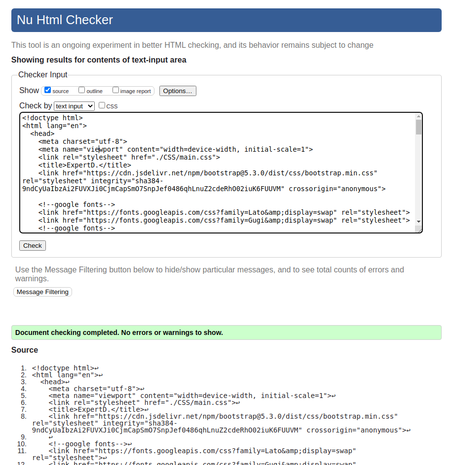

# Coursera-web-design-Capstone-project

This is a repository for the Portfolio Project (designed from scratch) of [Web Design For Everybody Specialization on Coursera (University of Michigan)](https://www.coursera.org/specializations/web-design).

**Web site**
you can visit the Portfolio [here](https://renarin14.github.io/Coursera-web-design-Capstone-project/)

**Build With:**
* HTML5
* CSS3
* Javascript
* Boostrap

**Sketches**

* **for screen**

* **for mobile**

w3 validator compliant

**Portfolio Demo**

